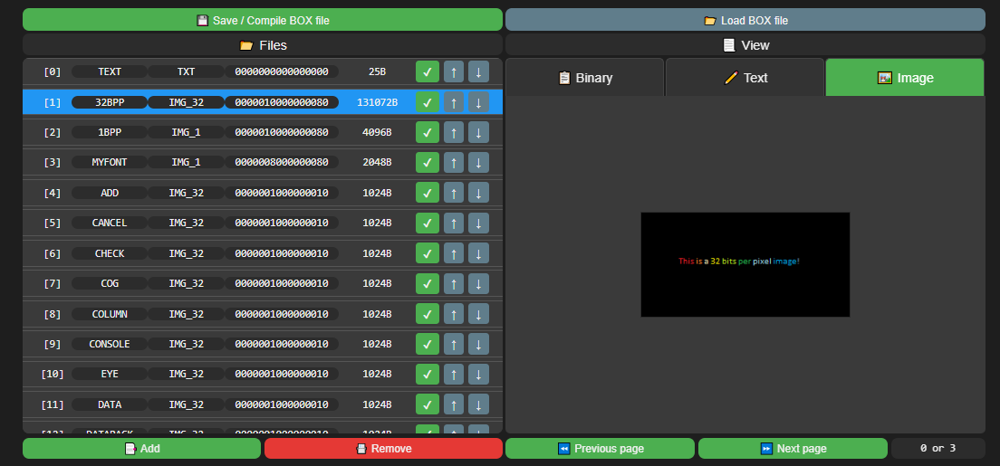

# BOX 📦
Binary Object Extended format.  
BOX is an experimental viewer/editor for `.box` files, a format designed to hold "stuff" (sprites, text blobs, data chunks, you name it) in modular blocks.  
The editor runs entirely in the browser, built with plain HTML and JavaScript, no frameworks involved.

## Features
- Interactive `.box` file viewer
- Block editor: create, edit, and delete content blocks
- Basic local save/load functionality
- Minimal but usable UI
- Occasional bugs included free of charge :D

## How to Run
No server required. Just, open it in your regular browser.

## Built With
- HTML5
- CSS3
- JavaScript (vanilla)

## Addendums
- `.box` is not a standard format, it's intentionally experimental.
- Inspired by `.WAD` and similar archival formats.
- 100% client-side. No backend. No magic autosave.

## Potential Future Improvements
- Compression.
- More intuitive UI/UX (e.g. drag-and-drop).
- Better Documentation XD.
